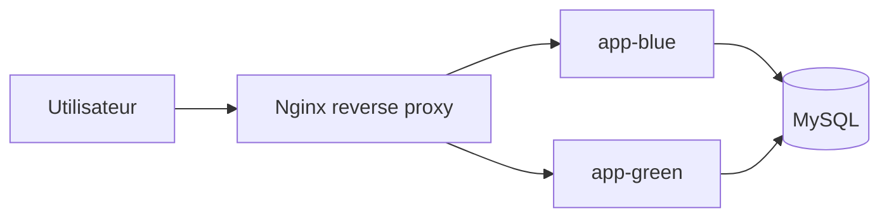

# CESIZEN

Application web CESIZEN (backend Laravel + frontend Vite/React) avec un workflow GitFlow, une CI auto-hebergee et une separation explicite entre CI et CD.


## Environnements Docker Compose (dev / test / prod)

Le projet tourne en **3 environnements Docker Compose isoles et persistants**, un par branche, capables
de fonctionner **simultanement sur la meme machine** sans conflit de ports ni de volumes.

| Branche | Environnement | Projet Compose | Frontend | Reverse proxy -> API | Base de donnees |
|---|---|---|---|---|---|
| `develop` | DEV | `cesizen-dev` | Vite dev server `:5173` | Nginx `:8000` | MySQL `:3306` (volume `cesizen-dev-db`) |
| `Test` | TEST | `cesizen-test` | Build statique (Nginx) `:5174` | Nginx `:8001` | MySQL `:3307` (volume `cesizen-test-db`) |
| `main` | PROD | `cesizen-prod` | Build statique (Nginx) `:5175` | Proxy blue/green `:8002` | MySQL `:3308` (volume `cesizen-prod-db`) |

Attention: la branche Git s'appelle `Test` (T majuscule) — c'est ce nom exact qui doit figurer dans les
`branches:` des workflows GitHub Actions (sensibles a la casse). L'identifiant d'environnement `test`
(minuscule, utilise dans `docker-compose.test.yml`, `.env.test`, les noms de projet Compose et les tags
GHCR) est une convention interne independante, sans lien avec la casse du nom de branche.

Isolation: chaque environnement a son propre `COMPOSE_PROJECT_NAME`, ses ports hote, son volume MySQL
nomme et son propre jeu de secrets (`.env.dev` / `.env.test` / `.env.prod`) — jamais partages entre
environnements. Les ports internes aux conteneurs restent identiques ; seuls les ports hote et les noms
de projet different.

### Fichiers par environnement
- `docker-compose.dev.yml` + `.env.dev` — build local (bind mount), hot-reload pour le developpement.
- `docker-compose.test.yml` + `.env.test` — images immuables tirees de GHCR (mêmes tags que la CD).
- `docker-compose.prod.yml` + `docker-compose.bluegreen.yml` + `.env.prod` — socle (mysql, frontend
  statique) + bascule blue/green pour l'API (voir "Deploiement blue/green" plus bas). `.env.prod` n'est
  pas versionne (secrets reels) ; partir de `.env.prod.example`.

Un seul fichier de compose par environnement (pas de duplication `override`) : c'est explicite et
autosuffisant pour un lancement manuel (`docker compose -f docker-compose.<env>.yml --env-file
.env.<env> -p cesizen-<env> ...`), ce qui correspond a la façon dont ce depot gerait deja `main` avant
cette evolution (`docker-compose.prod.yml` complet plutot qu'un override).

### Demarrage / arret manuel

```bash
# DEV
docker compose --env-file .env.dev -f docker-compose.dev.yml -p cesizen-dev up -d --build
docker compose --env-file .env.dev -f docker-compose.dev.yml -p cesizen-dev down

# TEST
docker compose --env-file .env.test -f docker-compose.test.yml -p cesizen-test up -d
docker compose --env-file .env.test -f docker-compose.test.yml -p cesizen-test down

# PROD (blue/green, voir plus bas) — utiliser scripts/bluegreen-deploy.sh plutot qu'un up/down direct
bash scripts/bluegreen-deploy.sh
```

En pratique, un seul script gere le cycle complet (down -> migrate -> pull -> up) de façon identique
pour les 3 environnements : `scripts/local-deploy.sh --env dev|test|prod` (voir "Deploiement local
automatise").

## Organisation Git

### Strategie de branches
- `main`: branche stable de production, deployee sur l'environnement PROD
- `Test`: branche de recette, deployee sur l'environnement TEST
- `develop`: branche d'integration, deployee sur l'environnement DEV
- `feature/ci-pipeline`: branche de travail principale pour la mise en place de la CI
- `feature/*`: autres fonctionnalites, creees depuis `develop`
- `hotfix/*`: corrections urgentes, creees depuis `main`

Chacune des 3 branches ci-dessus declenche automatiquement la CI et la CD vers son environnement
dedie (voir "Environnements Docker Compose" et "Separation CI / CD").

### Flux recommande
1. Partir de `main` pour creer ou mettre a jour `develop`.
2. Creer une branche `feature/...` pour une evolution ciblee.
3. Commiter en Conventional Commits.
4. Ouvrir une Pull Request vers la branche cible.
5. Fusionner uniquement via Pull Request apres revue et checks verts.

Exemple:
```bash
git checkout develop
git pull origin develop
git checkout -b feature/ma-fonctionnalite
```

## Ticketing GitHub (Issues + Project)

Le suivi des evolutions est base sur GitHub Issues et un board Kanban.

Organisation attendue pour la soutenance:
- colonnes: A faire, En cours, En revue, Termine
- labels: bug, evolution, priorite:critique, priorite:forte, priorite:mineure, securite

Templates disponibles dans `.github/ISSUE_TEMPLATE/`:
- `bug_report.yml`: modele Incident avec severite et SLA
- `feature_request.yml`: modele Demande d'evolution avec delai et cout estimes

Cycle de travail demontre:
1. creation de ticket
2. branche dediee (`feature/*` ou `hotfix/*`)
3. Pull Request avec lien vers le ticket
4. merge puis passage en Termine

## Qualite des commits (Husky + Commitlint)

Le depot utilise Husky a la racine.

Hooks actifs:
- `.husky/pre-commit`: execute `npm run lint:staged`
- `.husky/commit-msg`: execute `npx commitlint --edit "$1"`

Scripts racine:
- `prepare`: `husky install`
- `lint`: `npm --prefix frontend run lint`
- `lint:staged`: lint uniquement les fichiers JS/JSX stages dans `frontend/`

## Integration Continue (CI)

Fichier pipeline CI: `.github/workflows/ci.yml`

Le pipeline CI tourne sur un runner local self-hosted (`[self-hosted, linux]`) et couvre:
- installation des dependances backend/frontend
- tests backend (`php artisan test`, 84 tests)
- lint, tests et build frontend
- analyse SonarCloud + Quality Gate bloquante
- generation d'un script SQL de migration publie en artefact (`--pretend`, jamais applique)
- audit dependances (`composer audit` + `npm audit`)

La CI ne construit plus d'image Docker et ne deploie rien: ce role appartient entierement a la CD
(`.github/workflows/cd.yml`), qui reconstruit son propre artefact de migration pour le commit exact
qu'elle deploie (voir "Separation CI / CD"). Le scan Trivy des images se fait donc aussi cote CD, juste
avant le deploiement.

Declencheurs:
- `push` et `pull_request` sur `develop`, `Test` et `main`
- `workflow_dispatch`

Protection du runner self-hosted:
- les jobs CI ignores pour les PR provenant de forks externes
- seuls les PR internes au repository peuvent declencher les jobs sur le runner local

### Secrets SonarCloud requis
- `SONAR_TOKEN`
- `SONAR_ORG`
- `SONAR_PROJECT_KEY`

### Runner local (self-hosted)

Aucun workflow CI/CD (`ci.yml` comme `cd.yml`, tous deux en `runs-on: [self-hosted, linux]`) ne peut
s'executer sans un runner actif sur cette machine — contrairement a un runner GitHub cloud qui demarre
automatiquement, celui-ci doit etre lance et laisse actif **avant tout push**.

Installation (une seule fois):
1. Ouvrir GitHub: Settings > Actions > Runners > New self-hosted runner.
2. Choisir Linux x64 et executer les commandes fournies (telechargement, `./config.sh` avec le token
   d'enregistrement fourni par GitHub).
3. Lancer le runner en tache de fond avant de pousser du code:
   ```bash
   cd ~/actions-runner
   ./run.sh &            # ou: nohup ./run.sh > run.log 2>&1 &
   # alternative persistante (survit a la fermeture du terminal / reboot):
   sudo ./svc.sh install
   sudo ./svc.sh start
   ```

Verification rapide avant de pousser:
```bash
bash scripts/check-runner.sh
```
Ce script confirme (1) qu'un processus `Runner.Listener` tourne localement et (2) que GitHub voit bien
le runner en statut `online` via `gh api repos/<owner>/<repo>/actions/runners` (necessite `gh auth
login`). Ne pousser vers `develop`, `Test` ou `main` qu'une fois ce script vert.

## Migration SQL en CI (artefact)

Le pipeline CI genere un script SQL de migration sans l'appliquer sur une base reelle.

Script utilise:
- `scripts/generate-migration-sql.sh`

Ce script:
1. cree une base SQLite de travail en CI,
2. genere le SQL de migration en mode `--pretend`,
3. ecrit le resultat dans `backend/artifacts/migration.sql`.

Publication artefact:
- nom artefact: `migration-sql-script`
- fichier: `backend/artifacts/migration.sql`

Recuperation:
1. Ouvrir un run CI GitHub Actions.
2. Aller dans la section Artifacts.
3. Telecharger `migration-sql-script`.

Note importante: ce pipeline genere le script mais ne l'applique pas. L'application du script appartient au deploiement.

## Separation CI / CD

### CI (dans ce projet)
- build, lint, tests, analyse SonarCloud + Quality Gate
- generation et publication de l'artefact SQL de migration (`--pretend`)
- aucune image Docker, aucun deploiement, aucune application de migration sur un environnement reel

### CD (dans ce projet)
Fichier pipeline CD: `.github/workflows/cd.yml`

Meme logique de pipeline pour les 3 branches, uniquement parametree par l'environnement cible:
1. determination de l'environnement a partir de la branche (`develop`->dev, `Test`->test, `main`->prod;
   un push de tag `v*` cible toujours prod) — job `determine-environment`;
2. regeneration de l'artefact SQL de migration pour le commit exact deploye (memes commandes que la
   CI, sans dependre de son artefact pour eviter toute course entre les deux workflows);
3. build + push de l'image backend sur GHCR (`ghcr.io/lypouchh/cesizen-backend`), taguee
   `<env>-<sha-court>` (+ `latest` pour prod), scan Trivy (CRITICAL/HIGH bloquant);
4. build + push de l'image frontend statique (`ghcr.io/lypouchh/cesizen-frontend`) pour `test` et
   `prod` uniquement — l'environnement dev reste un serveur Vite construit localement a partir des
   sources checkoutees, il n'a pas besoin d'image pre-construite;
5. appel de `scripts/local-deploy.sh --env <dev|test|prod>` (voir plus bas);
6. smoke test post-deploiement sur le port API et le port frontend de l'environnement concerne.

Declencheurs: `push` vers `develop`, `Test` ou `main` (comportement identique), `workflow_dispatch`, et
`push` de tag `v*` (deploiement manuel d'une release officielle vers prod).

Rappel: le SQL de migration est produit et applique par la CD de maniere controlee (jamais sur une PR,
jamais sur un simple `push` vers une branche `feature/*`).

### Environnements GitHub et secrets requis
Le job de deploiement utilise `environment: <dev|test|prod>` (a creer dans Settings > Environments).
Seul l'environnement `prod` porte des secrets reels; `dev` et `test` utilisent les fichiers `.env.dev`
et `.env.test` deja versionnes (identifiants de developpement, non sensibles).

Secrets a definir sur l'environnement GitHub `prod`:
- `PROD_DB_DATABASE`, `PROD_DB_USERNAME`, `PROD_DB_PASSWORD`, `PROD_DB_ROOT_PASSWORD`
- `PROD_JWT_SECRET` (32+ caracteres)
- `PROD_APP_URL`, `PROD_CORS_ALLOWED_ORIGINS`

Secrets globaux (repository ou organisation):
- `SONAR_TOKEN`, `SONAR_ORG`, `SONAR_PROJECT_KEY`
- `GITHUB_TOKEN` (fourni automatiquement par Actions, permission `packages: write` necessaire pour GHCR)

Rien de ceci n'apparait en clair dans le code : `.env.prod` est genere a la volee par la CD a partir de
ces secrets puis ecrit uniquement sur le disque du runner (non commite, voir `.gitignore`).

## Deploiement local automatise

`scripts/local-deploy.sh --env <dev|test|prod>` est le **seul** script de deploiement — pas de
duplication par environnement, uniquement parametre par `--env`. Il est appele par `cd.yml` et peut
aussi etre lance a la main.

Ordre des operations (identique pour dev et test, uniquement parametre par `<env>`):
1. `docker compose --project-name cesizen-<env> -f docker-compose.<env>.yml down` — arrete uniquement
   la stack ciblee, sans toucher aux deux autres environnements qui peuvent tourner en parallele;
2. demarrage isole du service MySQL de cet environnement;
3. application du script `backend/artifacts/migration.sql` (rejouable, jamais de suppression/recreation
   de la base);
4. `docker compose pull` de l'image GHCR taguee pour cette branche;
5. relance complete de la stack ciblee (`up -d --build`) sans intervention manuelle.

Pour `prod`, le script delegue entierement a `scripts/bluegreen-deploy.sh` (voir juste apres) afin de
conserver la bascule sans coupure deja en place, plutot qu'un `down`/`up` classique qui couperait le
service.

Condition d'activation: automatique sur `push` vers `develop`, `Test` ou `main` (voir `cd.yml`), jamais
sur une `pull_request`.

### Rollback (dev / test)

Chaque environnement peut revenir a la version precedente en redeployant simplement le tag SHA
anterieur correspondant a sa branche:
```bash
# ex: revenir a un commit precedent sur test
sed -i 's/^IMAGE_TAG=.*/IMAGE_TAG=test-<sha-court-precedent>/' .env.test
bash scripts/local-deploy.sh --env test
```
L'image est deja poussee sur GHCR (chaque run de CD conserve son tag), `docker compose pull` la
recupere directement sans reconstruction. Le rollback de `prod` suit la meme logique via
`IMAGE_TAG` dans `.env.prod`, mais passe par la bascule blue/green (voir plus bas) plutot qu'un
redemarrage direct.

## Deploiement blue/green

Le TP5 remplace la coupure par une bascule entre deux conteneurs applicatifs:
- `app-blue`
- `app-green`

Un reverse proxy Nginx unique expose l'application et redirige vers la couleur active. La bascule se fait en modifiant un fichier de configuration monté dans le proxy, puis en rechargeant Nginx.

Fichiers utilisés:
- `docker-compose.prod.yml`: socle de deploiement (MySQL sur reseau interne, frontend statique)
- `docker-compose.bluegreen.yml`: blue/green avec les deux versions de l'API et le proxy (`:8002`)
- `.env.prod` (non versionne, voir `.env.prod.example`): secrets et ports de l'environnement prod
- `backend/docker/nginx/bluegreen/default.conf`: reverse proxy
- `backend/docker/nginx/bluegreen/includes/active-upstream.conf`: couleur active
- `scripts/bluegreen-deploy.sh`: bascule automatisee dans le pipeline, isolee via
  `--project-name cesizen-prod` pour cohabiter avec les stacks dev/test

Ordre de deploiement:
1. Identifier la couleur active depuis `includes/active-upstream.conf`.
2. Démarrer la couleur inactive avec la nouvelle image.
3. Vérifier sa santé via `/health`.
4. Appliquer les migrations SQL de manière compatible avant la bascule.
5. Mettre à jour `active-upstream.conf` pour pointer vers la nouvelle couleur.
6. Recharger Nginx.
7. Arrêter l’ancienne couleur seulement si la vérification proxy est bonne.

Stratégie base de données:
- les deux versions partagent la même base MySQL;
- les migrations doivent être rétro-compatibles de type expand/contract;
- on ajoute d’abord les nouvelles colonnes et la nouvelle logique sans supprimer les anciennes;
- on bascule le proxy seulement après migration et validation;
- en rollback, on remet simplement l’ancien upstream derrière le proxy sans reconstruire la base.

Schéma:


Commande de déploiement blue/green (nécessite `.env.prod`, voir `.env.prod.example`):
```bash
bash scripts/bluegreen-deploy.sh
```

Rollback:
- réécrire `includes/active-upstream.conf` pour viser l’ancienne couleur;
- recharger Nginx;
- conserver le schéma compatible pour que l’ancienne version continue de fonctionner.

## Securite applicative (OWASP)

Mesures implementees:
- journalisation securite dediee (`backend/config/logging.php`, channel `security`)
- traces des evenements sensibles: echec login, refus admin, reset password, actions admin
- renforcement mot de passe (longueur et complexite) pour inscription/changement/reset
- throttling auth (login/register/reset) via rate limiter backend
- JWT signe en `HS256` configurable (`backend/config/jwt.php`)

Hardening reverse proxy prod:
- `X-Frame-Options: DENY`
- `X-Content-Type-Options: nosniff`
- `Referrer-Policy: strict-origin-when-cross-origin`
- `Strict-Transport-Security`
- `Content-Security-Policy`
- `Permissions-Policy`

Notes de deploiement securite:
- le port MySQL de chaque environnement (`3306`/`3307`/`3308`) n'est publie que sur `127.0.0.1`, jamais
  sur toutes les interfaces
- `APP_DEBUG=false` en production
- le socle TLS avec certificat (`backend/docker/nginx/prod/app.conf`, `docker/nginx/ssl/`) reste
  disponible pour une exposition internet reelle derriere un nom de domaine, mais n'est pas branche par
  defaut: la demo des 3 environnements en parallele sur un seul poste utilise le reverse proxy blue/green
  en clair sur `localhost:8002` (aucun des 3 environnements n'est expose au-dela de la machine locale)

## Sauvegarde et restauration MySQL

Scripts fournis:
- `scripts/mysql-backup.sh`: export gzip via `mysqldump`
- `scripts/mysql-restore.sh`: restauration depuis `.sql` ou `.sql.gz`

Exemples:
```bash
bash scripts/mysql-backup.sh
bash scripts/mysql-restore.sh backups/mysql/cesizen_YYYYMMDD_HHMMSS.sql.gz
```

Recommandation:
- planifier `mysql-backup.sh` (cron) et tester une restauration reguliere sur un environnement de recette.

## Supervision minimale

Supervision de base integree:
- healthchecks Docker (MySQL + blue/green)
- endpoint de sante backend: `/health`
- logs applicatifs et logs securite (`storage/logs/security-*.log`)

Pour une demo soutenance:
- brancher Uptime Kuma sur l'URL proxifiee et l'endpoint `/health`.

## Protection des branches (GitHub)

Configuration recommandee:
- interdire les push directs
- exiger une PR approuvee
- sur `develop`, `Test` et `main`: exiger `CI/backend-tests (pull_request)`,
  `CI/frontend-quality (pull_request)`, `CI/migration-sql (pull_request)` et
  `CI/sonarcloud (pull_request)` (Quality Gate SonarCloud bloquante sur les 3 branches)

## Authentification API (JWT)

Le backend Laravel utilise des JWT courts avec refresh token rotatif:
- `access_token` JWT (duree courte)
- `refresh_token` stocke cote serveur sous forme hachee et envoye en cookie `HttpOnly`

Variables principales:
- `JWT_SECRET`
- `JWT_TTL`
- `JWT_REFRESH_TOKEN_TTL`
- `JWT_REFRESH_COOKIE_NAME`

## Lancement avec Docker

### Images publiees
- `ghcr.io/lypouchh/cesizen-backend` — tags `dev-<sha>` / `test-<sha>` / `prod-<sha>` + `latest` sur `main`
- `ghcr.io/lypouchh/cesizen-frontend` (build statique, test/prod uniquement) — meme schema de tags

Prerequis:
- Docker Desktop (ou Docker Engine + Compose)
- Git

Demarrage rapide (environnement DEV local):
```bash
chmod +x docker-init.sh
./docker-init.sh
```

Voir la section "Environnements Docker Compose" en tete de ce README pour les commandes de
demarrage/arret detaillees des 3 environnements (dev/test/prod) et leur tableau de ports.

Commandes utiles (environnement dev):
```bash
docker compose --env-file .env.dev -f docker-compose.dev.yml -p cesizen-dev ps
docker compose --env-file .env.dev -f docker-compose.dev.yml -p cesizen-dev logs -f
docker compose --env-file .env.dev -f docker-compose.dev.yml -p cesizen-dev down
docker compose --env-file .env.dev -f docker-compose.dev.yml -p cesizen-dev exec laravel php artisan test
```

Conditions d'execution du pipeline CD (build image + deploiement):
- runner local self-hosted actif (voir "Runner local (self-hosted)")
- secret GitHub natif pour publier dans GHCR (`GITHUB_TOKEN` avec permission `packages: write`)
- execution sur `push` vers `develop`, `Test` ou `main`, sur tag `v*`, et via `workflow_dispatch`
- verification apres deploiement par un smoke test sur l'API et le frontend de l'environnement concerne

Badges pipelines:


Pour la documentation Docker detaillee de l'environnement dev local, voir `DOCKER_SETUP.md`.
