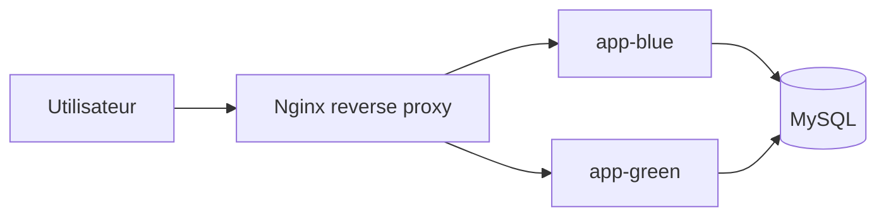

# CESIZEN

Application web CESIZEN (backend Laravel + frontend Vite/React) avec un workflow GitFlow, une CI auto-hebergee et une separation explicite entre CI et CD.


## Organisation Git

### Strategie de branches
- `main`: branche stable de production
- `develop`: branche d'integration
- `feature/ci-pipeline`: branche de travail principale pour la mise en place de la CI
- `feature/*`: autres fonctionnalites, creees depuis `develop`
- `hotfix/*`: corrections urgentes, creees depuis `main`

### Flux recommande
1. Partir de `main` pour creer ou mettre a jour `develop`.
2. Creer une branche `feature/...` pour une evolution ciblee.
3. Commiter en Conventional Commits.
4. Ouvrir une Pull Request vers la branche cible.
5. Fusionner uniquement via Pull Request apres revue et checks verts.

Exemple:
```bash
git checkout develop
git pull origin develop
git checkout -b feature/ma-fonctionnalite
```

## Ticketing GitHub (Issues + Project)

Le suivi des evolutions est base sur GitHub Issues et un board Kanban.

Organisation attendue pour la soutenance:
- colonnes: A faire, En cours, En revue, Termine
- labels: bug, evolution, priorite:critique, priorite:forte, priorite:mineure, securite

Templates disponibles dans `.github/ISSUE_TEMPLATE/`:
- `bug_report.yml`: modele Incident avec severite et SLA
- `feature_request.yml`: modele Demande d'evolution avec delai et cout estimes

Cycle de travail demontre:
1. creation de ticket
2. branche dediee (`feature/*` ou `hotfix/*`)
3. Pull Request avec lien vers le ticket
4. merge puis passage en Termine

## Qualite des commits (Husky + Commitlint)

Le depot utilise Husky a la racine.

Hooks actifs:
- `.husky/pre-commit`: execute `npm run lint:staged`
- `.husky/commit-msg`: execute `npx commitlint --edit "$1"`

Scripts racine:
- `prepare`: `husky install`
- `lint`: `npm --prefix frontend run lint`
- `lint:staged`: lint uniquement les fichiers JS/JSX stages dans `frontend/`

## Integration Continue (CI)

Fichier pipeline CI: `.github/workflows/ci.yml`

Le pipeline CI tourne sur un runner local self-hosted (`[self-hosted, linux]`) et couvre:
- installation des dependances backend/frontend
- tests backend (`php artisan test`)
- lint, tests et build frontend
- analyse SonarCloud + Quality Gate
- generation d'un script SQL de migration publie en artefact
- audit dependances (`composer audit` + `npm audit`)
- scan de vulnerabilites image Docker via Trivy

Declencheurs:
- `push` et `pull_request` sur `develop` et `main`
- `workflow_dispatch`

Protection du runner self-hosted:
- les jobs CI ignores pour les PR provenant de forks externes
- seuls les PR internes au repository peuvent declencher les jobs sur le runner local

### Secrets SonarCloud requis
- `SONAR_TOKEN`
- `SONAR_ORG`
- `SONAR_PROJECT_KEY`

### Runner local (self-hosted)
1. Ouvrir GitHub: Settings > Actions > Runners > New self-hosted runner.
2. Choisir Linux x64 et executer les commandes fournies.
3. Verifier que le runner est `Online` avant de lancer la CI.
4. La CI de ce depot s'exécute sur la machine locale via ce runner auto-heberge.

## Migration SQL en CI (artefact)

Le pipeline CI genere un script SQL de migration sans l'appliquer sur une base reelle.

Script utilise:
- `scripts/generate-migration-sql.sh`

Ce script:
1. cree une base SQLite de travail en CI,
2. genere le SQL de migration en mode `--pretend`,
3. ecrit le resultat dans `backend/artifacts/migration.sql`.

Publication artefact:
- nom artefact: `migration-sql-script`
- fichier: `backend/artifacts/migration.sql`

Recuperation:
1. Ouvrir un run CI GitHub Actions.
2. Aller dans la section Artifacts.
3. Telecharger `migration-sql-script`.

Note importante: ce pipeline genere le script mais ne l'applique pas. L'application du script appartient au deploiement.

## Separation CI / CD

### CI (dans ce projet)
- build, lint, tests, analyse SonarCloud
- generation et publication de l'artefact SQL de migration
- aucune application automatique de migration sur un environnement reel

### CD (dans ce projet)
Fichier pipeline CD: `.github/workflows/cd.yml`

- workflow de deploiement separe du pipeline CI
- declenchement manuel (`workflow_dispatch`) ou sur tag `v*`
- rappel explicite: le SQL de migration est produit par la CI mais son application est une operation de deploiement controlee, jamais automatique sur une PR

## Deploiement local automatise

Le premier stage de deploiement automatise du projet utilisait `scripts/local-deploy.sh` pour valider l'approche TP4.
Pour le TP5, le chemin actif est desormais la bascule blue/green decrite juste après, via `scripts/bluegreen-deploy.sh`.

Ordre des operations:
1. arreter la stack existante avec `docker compose down`
2. demarrer uniquement MySQL
3. appliquer automatiquement le script SQL genere en CI et publie en artefact (`backend/artifacts/migration.sql`)
4. tirer la nouvelle image depuis GHCR
5. relancer l'application sans intervention manuelle

Le script SQL applique ici vient de l'artefact du TP2/CI. Il est rejouable et n'effectue pas de suppression/recreation de la base: le deploiement applique les migrations avant la remise en ligne applicative pour eviter d'exposer une version a un schema obsolet.

Condition d'activation:
- execution automatique uniquement sur `push` vers `main`
- non execute sur les `pull_request`

## Deploiement blue/green

Le TP5 remplace la coupure par une bascule entre deux conteneurs applicatifs:
- `app-blue`
- `app-green`

Un reverse proxy Nginx unique expose l'application et redirige vers la couleur active. La bascule se fait en modifiant un fichier de configuration monté dans le proxy, puis en rechargeant Nginx.

Fichiers utilisés:
- `docker-compose.prod.yml`: socle de deploiement (base de donnees sur reseau interne)
- `docker-compose.bluegreen.yml`: blue/green avec les deux versions et le proxy
- `backend/docker/nginx/bluegreen/default.conf`: reverse proxy
- `backend/docker/nginx/bluegreen/includes/active-upstream.conf`: couleur active
- `scripts/bluegreen-deploy.sh`: bascule automatisee dans le pipeline

Ordre de deploiement:
1. Identifier la couleur active depuis `includes/active-upstream.conf`.
2. Démarrer la couleur inactive avec la nouvelle image.
3. Vérifier sa santé via `/health`.
4. Appliquer les migrations SQL de manière compatible avant la bascule.
5. Mettre à jour `active-upstream.conf` pour pointer vers la nouvelle couleur.
6. Recharger Nginx.
7. Arrêter l’ancienne couleur seulement si la vérification proxy est bonne.

Stratégie base de données:
- les deux versions partagent la même base MySQL;
- les migrations doivent être rétro-compatibles de type expand/contract;
- on ajoute d’abord les nouvelles colonnes et la nouvelle logique sans supprimer les anciennes;
- on bascule le proxy seulement après migration et validation;
- en rollback, on remet simplement l’ancien upstream derrière le proxy sans reconstruire la base.

Schéma:


Commande de déploiement blue/green:
```bash
bash scripts/bluegreen-deploy.sh
```

Rollback:
- réécrire `includes/active-upstream.conf` pour viser l’ancienne couleur;
- recharger Nginx;
- conserver le schéma compatible pour que l’ancienne version continue de fonctionner.

## Securite applicative (OWASP)

Mesures implementees:
- journalisation securite dediee (`backend/config/logging.php`, channel `security`)
- traces des evenements sensibles: echec login, refus admin, reset password, actions admin
- renforcement mot de passe (longueur et complexite) pour inscription/changement/reset
- throttling auth (login/register/reset) via rate limiter backend
- JWT signe en `HS256` configurable (`backend/config/jwt.php`)

Hardening reverse proxy prod:
- `X-Frame-Options: DENY`
- `X-Content-Type-Options: nosniff`
- `Referrer-Policy: strict-origin-when-cross-origin`
- `Strict-Transport-Security`
- `Content-Security-Policy`
- `Permissions-Policy`

Notes de deploiement securite:
- le port MySQL n'est pas publie dans `docker-compose.prod.yml`
- `APP_DEBUG=false` en production
- certificat TLS: mode demonstration (self-signed acceptable pour la soutenance)

## Sauvegarde et restauration MySQL

Scripts fournis:
- `scripts/mysql-backup.sh`: export gzip via `mysqldump`
- `scripts/mysql-restore.sh`: restauration depuis `.sql` ou `.sql.gz`

Exemples:
```bash
bash scripts/mysql-backup.sh
bash scripts/mysql-restore.sh backups/mysql/cesizen_YYYYMMDD_HHMMSS.sql.gz
```

Recommandation:
- planifier `mysql-backup.sh` (cron) et tester une restauration reguliere sur un environnement de recette.

## Supervision minimale

Supervision de base integree:
- healthchecks Docker (MySQL + blue/green)
- endpoint de sante backend: `/health`
- logs applicatifs et logs securite (`storage/logs/security-*.log`)

Pour une demo soutenance:
- brancher Uptime Kuma sur l'URL proxifiee et l'endpoint `/health`.

## Protection des branches (GitHub)

Configuration recommandee:
- interdire les push directs
- exiger une PR approuvee
- sur `develop`: exiger `CI/backend-tests (pull_request)`, `CI/frontend-quality (pull_request)`, `CI/migration-sql (pull_request)`
- sur `main`: exiger les memes checks CI + `SonarCloud Code Analysis`
- sur `main`: exiger une Quality Gate verte via SonarCloud

## Authentification API (JWT)

Le backend Laravel utilise des JWT courts avec refresh token rotatif:
- `access_token` JWT (duree courte)
- `refresh_token` stocke cote serveur sous forme hachee et envoye en cookie `HttpOnly`

Variables principales:
- `JWT_SECRET`
- `JWT_TTL`
- `JWT_REFRESH_TOKEN_TTL`
- `JWT_REFRESH_COOKIE_NAME`

## Lancement avec Docker

### Image publiee
- Registre: `ghcr.io/lypouchh/cesizen-backend`
- Tags publies: `latest` sur `main`, tag de branche et tag SHA sur les pushes CI

Prerequis:
- Docker Desktop (ou Docker Engine + Compose)
- Git

Demarrage rapide:
```bash
chmod +x docker-init.sh
./docker-init.sh
```

Execution standardisee avec Docker Compose:
```bash
docker compose up -d --build
```

Execution de l'environnement de production avec l'image distante:
```bash
docker compose -f docker-compose.prod.yml up -d
```

Commandes utiles:
```bash
docker-compose ps
docker-compose logs -f
docker-compose down
docker-compose exec laravel php artisan test
```

Conditions d'execution du pipeline Docker:
- runner local self-hosted
- secret GitHub natif pour publier dans GHCR (`GITHUB_TOKEN` avec permission `packages: write`)
- execution sur `push` vers `main` et via `workflow_dispatch`
- verification apres build par un smoke test sur l'image poussee

Badge pipeline Docker:


Pour la documentation Docker detaillee, voir `DOCKER_SETUP.md`.
